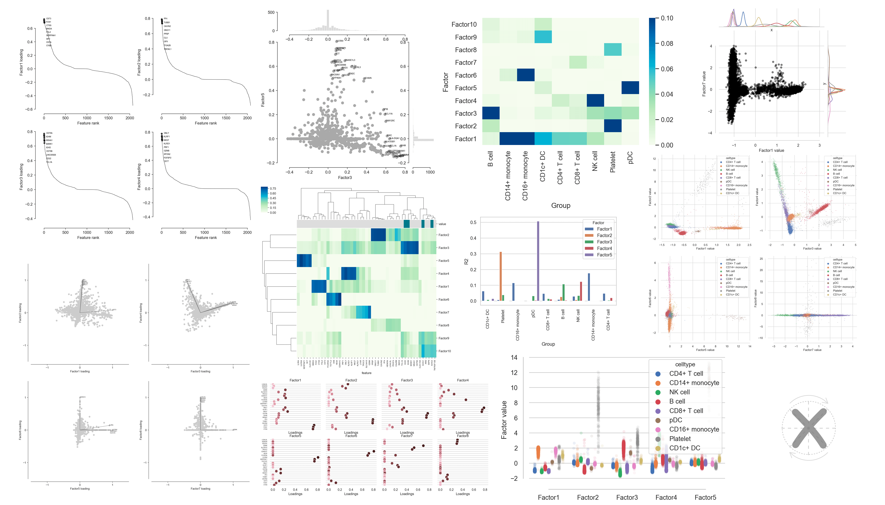

Work with trained factor models in Python.

This library provides convenience functions to load and visualize factor models trained with MOFA+ in Python. For more information on the multi-omics factor analysis v2 framework please see [mofapy2](https://github.com/bioFAM/mofapy2) and [MOFA2](https://github.com/bioFAM/MOFA2) GitHub repositories as well as [the website](https://biofam.github.io/MOFA2/).

## Getting started

### Installation

```
pip install git+https://github.com/gtca/mofax
# or
pip install mofax
```

### Training a factor model

Please see the [MOFA+ GitHub repository](https://github.com/bioFAM/MOFA2) for more information on training the factor models with MOFA+.

### Loading the model

Import the module and create a connection to the HDF5 file with the trained model:

```python
import mofax as mfx

model = mfx.mofa_model("trained_mofaplus_model.hdf5")
```

The connection is created in the readonly mode by default and can be terminated by calling the `close()` method on the model object at the end of the working session:

```python
model.close()
```

#### Model object

Model object is an instance of a `mofa_model` class that wraps around the HDF5 connection and provides a simple way to address the parts of the trained model such as expectations for factors and for their loadings (weights) eliminating the need to traverse the HDF5 file manually. The original connection to the HDF5 file is exposed via the `model.model` attribute.

#### Model methods

Simple data structures (e.g. lists or dictionaries) are typically returned upon accessing the properties of the mofa model, e.g. `model.shape`:

```python
model.shape
# returns (10138, 1124)
#       samples^  ^features
#       (cells)
```

More complex structures are typically returned when calling methods such as `model.get_samples()` to get `sample -> group` assignment as a pandas.DataFrame while also providing the way to only get this information for specific groups or views of the model. `model.get_cells()` works the same way.

```python
model.get_cells().head()
# returns a pandas.DataFrame object:
# 	group	cell
# 0	T_CD4	AATCCTGCACATCGCC-1
# 1	T_CD4	AAGACGTGTGATGCCC-1
# 2	T_CD4	AAGGAGCGTCGGCATG-1
# 3	T_CD4	AATCCGTCACGAGACG-1
# 4	T_CD4	ACACCGAGGAGGTTGA-1
```

Use `model.metadata` to get the metadata table — it's a shorhand for `samples_metadata`, there's also `features_metadata` available. 

```python
model.metadata.head()
# returns a pandas.DataFrame object:
#                     group  n_genes
# sample
# AATCCTGCACATCGCC-1  T_CD4     1087
# AAGACGTGTGATGCCC-1  T_CD4     1836
# AAGGAGCGTCGGCATG-1  T_CD4     2216
# AATCCGTCACGAGACG-1  T_CD4     1615
# ACACCGAGGAGGTTGA-1  T_CD4     1800
```

To get expectations of W (weights) and Z (factors) matrices, use `get_weights()` and `get_factors()`, respectively. There's also a `df=True` option to get expectations as a Pandas data frame rather than a NumPy 2D array.

```python
model.get_factors(factors=range(3), df=True).head()
#                      Factor1   Factor2   Factor3
# AATCCTGCACATCGCC-1  0.012582 -0.093512 -0.011228
# AAGACGTGTGATGCCC-1  0.001091 -0.027217 -0.011331
# AAGGAGCGTCGGCATG-1 -0.015097  0.093493 -0.010593
# AATCCGTCACGAGACG-1 -0.046222  0.225920  0.010083
# ACACCGAGGAGGTTGA-1  0.011766 -0.055964 -0.011298
```

Variance explained by each factor per view and per group is calculated during the tranining and stored in the model file and can be accessed with `get_r2()`:

```python
model.get_r2().head()
# 	Factor	View        Group	R2
# 0	Factor1	drugs       group1	13.589131
# 1	Factor1	methylation group1	17.330235
# 2	Factor1	rna         group1	7.032133
# 3	Factor1	mutations   group1	22.725224
# 4	Factor2	drugs       group1	26.374409
```

#### MEFISTO models support

[MEFISTO models](https://biofam.github.io/MOFA2/MEFISTO) can feature a few additional concepts such as _covariates_ and _interpolated factors_. Covariates can be accessed via `model.covariates_names` and `model.covariates`. If interpolated factors were learnt for new values during training, they are exposed at `model.interpolated_factors` and also can be obtained in a long DataFrame with `model.get_interpolated_factors(df_long=True)`.

#### Utility functions

A few utility functions such as `calculate_factor_r2` to calculate the variance explained by a factor are provided as well.

#### Plotting functions

A few basic plots can be constructed with plotting functions provided such as `plot_factors` and `plot_weights`. They rely on and limited by plotting functionality of Seaborn.

Please [check the notebooks](notebooks/) for detailed examples. Some of the implemented plots are demonstrated below.



## Contributions

In case you work with MOFA+ models in Python, you might find `mofax` useful. Please consider contributing to this module by suggesting the missing functionality to be implemented [in the form of issues](https://github.com/gtca/mofax/issues) and in the form of [pull requests](https://github.com/gtca/mofax/pulls).
